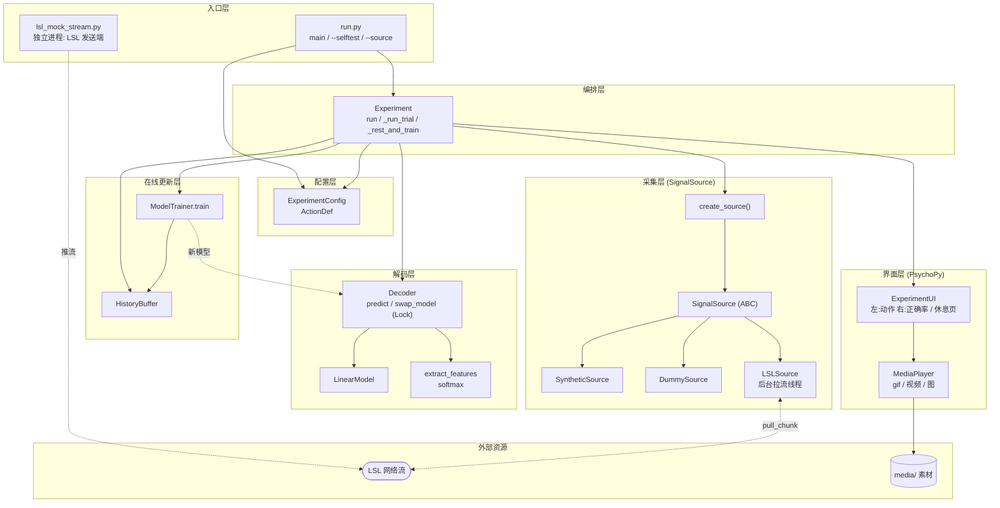
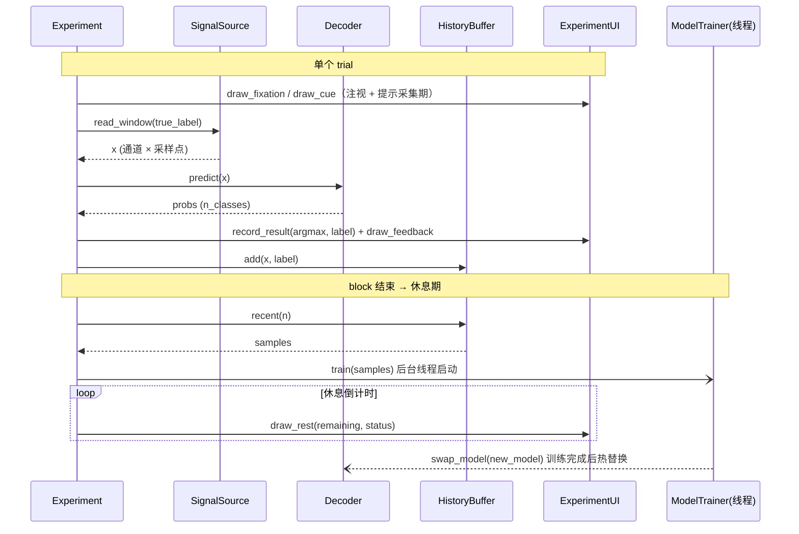

# 架构说明 — SEEG 脑机接口交互范式

本文档分析当前程序架构，并用图示说明模块分层、数据流与并发模型。

## 1. 分层与模块职责

| 层 | 模块 / 类 | 职责 |
|----|-----------|------|
| 入口层 | `run.py`（`main` / `_selftest`）、`lsl_mock_stream.py` | 解析命令行、装配配置并启动 `Experiment`；模拟流脚本作为**独立进程**充当 LSL 发送端 |
| 配置层 | `config.ExperimentConfig` / `ActionDef` / `load_config` | 集中所有可调参数（动作集、时长、通道/采样、信号源类型、LSL 参数、显示）；可由根目录 `paradigm_config.toml`（范式配置文件）外部加载，优先级：默认值 < 配置文件 < 命令行 |
| 编排层 | `experiment.Experiment` | block-trial 主循环、采集→解码→反馈、休息期后台训练与模型热替换 |
| 采集层 | `signal_source.*` + `create_source()` | 统一接口 `SignalSource`，三实现：`LSLSource`（外部实时）/`DummySource`（纯随机）/`SyntheticSource`（可分模拟） |
| 解码层 | `decoder.Decoder` / `LinearModel` / `extract_features` / `softmax` | 线程安全实时解码：`predict(x)→概率分布`，`swap_model` 热替换 |
| 在线更新层 | `model_update.HistoryBuffer` / `ModelTrainer` | 历史样本缓冲 + 离线训练产出新模型 |
| 界面层 | `ui.ExperimentUI` / `MediaPlayer` | PsychoPy 可视化：左=动作提示+gif/视频，右=当前动作正确率，休息页 |

**核心契约**（替换真实算法时保持不变）：
- 解码：`Decoder.predict(ndarray[通道,采样点]) -> ndarray[n_classes]`（概率分布，和为 1）
- 训练：`ModelTrainer.train([(x,label),...]) -> model`（实现 `infer(features)->logits` 即可被 `swap_model` 接收）

## 2. 组件架构图



## 3. 运行时数据流（trial 与休息）



## 4. 并发模型

程序运行时最多有三类线程，通过锁与“快照”解耦：

```
主线程 (Experiment.run)
  └─ PsychoPy 绘制 / 事件 / 时序循环；调用 predict、record_result、draw_*

LSL 拉流线程 (LSLSource._pull_loop, 仅 source=lsl)
  └─ 持续 pull_chunk → deque 环形缓冲 (self._lock 保护)
     read_window() 在主线程取缓冲快照并转置

训练线程 (Experiment._rest_and_train, 仅休息期临时存在)
  └─ ModelTrainer.train(历史样本快照) → 新 LinearModel
     → Decoder.swap_model() 在 Decoder._lock 下原子替换
```

- `Decoder._lock`：`predict`（主线程）与 `swap_model`（训练线程）互斥，保证热替换原子。
- `HistoryBuffer._lock`：`add`（主线程）与 `recent`（训练线程读快照）互斥。
- `LSLSource._lock`：拉流线程写、主线程读，二者互斥。
- 训练以历史样本**快照**为输入，训练期间主线程可继续采集/入缓冲，互不阻塞。

## 5. 进程拓扑（LSL 模式）

```
┌─────────────────────────┐        LSL 网络        ┌──────────────────────────┐
│ 进程 A: 发送端           │  ─── push_chunk ───▶  │ 进程 B: 范式             │
│ lsl_mock_stream.py       │                        │ run.py → Experiment      │
│ 或 真实设备 LSL 连接程序 │  ◀── resolve/inlet ──  │ LSLSource (拉流线程)     │
└─────────────────────────┘                        └──────────────────────────┘
```
dummy / synthetic 模式无进程 A，数据在范式进程内部生成。
