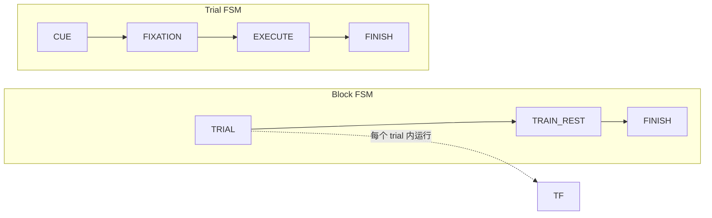
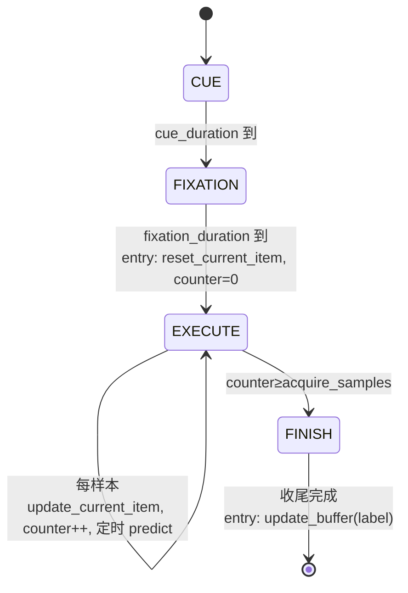
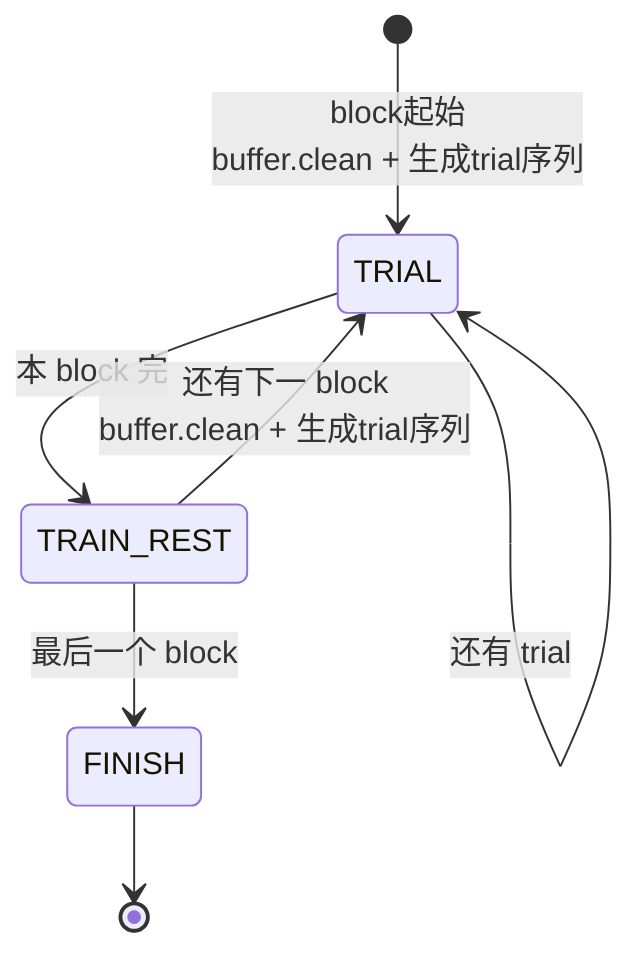

# 范式运行的 FSM 设计方案

用两层有限状态机（FSM）规范范式运行：**block 级** FSM 驱动 trial 循环与休息训练；
**trial 级** FSM 在每个 trial 内规范采集/计数/缓存/存档。trial FSM 嵌套在 block FSM 的
`TRIAL` 状态内运行。

## 1. 目标
- 把“何时采集 / 何时计数 / 何时缓存 / 何时存档 / 何时训练”用显式状态 + 转移 + 进入/退出动作固化。
- 落实约定：**计数器与缓存仅在 START 运行**；进入 START 清单次缓存；START→IDLE 存档；block 末用本 block 样本更新模型。

## 2. 总体结构



组件交互：`SignalSource`（逐样本流式）→ `BlockBuffer`（trial 窗口 + block 存档）→
`Decoder.update`（block 末训练，内部走 `model_update.ModelTrainer`）；`Decoder.predict` 在
EXECUTE 期实时解码；`ExperimentUI` 负责显示。

## 3. Trial 级 FSM（CUE / FIXATION / EXECUTE / FINISH）

一个 trial 依次经过四个阶段；其中只有 **EXECUTE（执行）** 是采集态——计数器与缓存**仅在 EXECUTE 运行**。

| 状态 | 含义 | 显示 | do / 动作 |
|------|------|------|-----------|
| `CUE` | 提示阶段 | **全屏**文字「当前动作为：{label}」 | 仅显示；不计数、不缓存 |
| `FIXATION` | 盯点阶段 | **全屏**白色十字「+」 | 仅显示；不计数、不缓存 |
| `EXECUTE` | 执行/采集阶段 | 动作名 + 右侧实时正确率（沿用现面板） | 每个样本 `[C,1]`：`buffer.update_current_item(s)`；`counter += 1`；按 `predict_interval` 跑 `decoder.predict(buffer.current_item)` 实时刷新正确率 |
| `FINISH` | trial 收尾（终态） | 可选 trial 间空屏（ITI） | **entry**：`buffer.update_buffer(label)` 存档；随后把控制权交回 block FSM |

| 转移 | 触发 | 动作 |
|------|------|------|
| `CUE → FIXATION` | `cue_duration` 到 | — |
| `FIXATION → EXECUTE` | `fixation_duration` 到 | **entry EXECUTE**：`buffer.reset_current_item()`（清单次缓存）+ `counter = 0` |
| `EXECUTE → FINISH` | `counter >= acquire_samples`（采集满） | — |
| `FINISH → [*]` | 收尾完成（可选 ITI 到时） | **entry FINISH**：`buffer.update_buffer(label)` |



注：CUE/FIXATION 为非采集态（原“IDLE”职责拆成这两个具体阶段）；EXECUTE 即原“START”采集态；
存档动作移到 `FINISH` 入口，作为 trial 的统一收尾点（也便于以后挂 trial 间隔 ITI）。不再单列反馈阶段。

## 4. Block 级 FSM（TRIAL / TRAIN_REST / FINISH）

| 状态 | 含义 | 动作 |
|------|------|------|
| `TRIAL` | 跑当前 block 的一个 trial | 运行一轮 trial FSM；trial 计数 +1 |
| `TRAIN_REST` | block 末休息 + 训练 | entry：后台线程 `decoder.update(buffer.items)`；显示“请休息”，更新完成后提示“按空格开始下一 block”并等待按键（无倒计时） |
| `FINISH` | 全部 block 结束（终态） | 显示总体正确率，等待退出 |

| 转移 | 触发 | 转移动作 |
|------|------|----------|
| `[*] → TRIAL` | 实验开始 | **block 起始**：`buffer.clean()` + 生成本 block 平衡打乱的 trial 序列 |
| `TRIAL → TRIAL` | `done < trials_per_block` | — |
| `TRIAL → TRAIN_REST` | 本 block 最后一个 trial 完成 | — |
| `TRAIN_REST → TRIAL` | 休息结束且有下一 block | **block 起始**：`buffer.clean()` + 生成下一 block 序列 |
| `TRAIN_REST → FINISH` | 休息结束且为最后一个 block | — |



全程 `Esc` 可中断退出（视为强制转移到终态）。

## 5. 与现有组件的映射

| FSM 动作 | 现有/新增组件 |
|----------|----------------|
| CUE 显示 | **新增** `ui.draw_cue_text(label)`：全屏「当前动作为：{label}」 |
| FIXATION 显示 | **新增** `ui.draw_fixation_cross()`：全屏白色十字「+」 |
| EXECUTE do：取样 | **新增** `SignalSource.read_sample() -> ndarray[C,1]`（LSL 用 `pull_sample`；synthetic/dummy 逐列生成） |
| EXECUTE do：缓存 | `BlockBuffer.update_current_item` |
| EXECUTE do：实时解码 | `Decoder.predict`（`predict_interval` 控制频率） |
| entry EXECUTE：清单次缓存 | `BlockBuffer.reset_current_item()`（即把现私有 `_reset_window` 公开） |
| entry FINISH：存档 | `BlockBuffer.update_buffer(label)` |
| block 起始：清空 | `BlockBuffer.clean()` |
| TRAIN_REST：训练 | `Decoder.update(buffer.items)` → 内部 `model_update.ModelTrainer.train` + 锁内热替换 |

说明：FSM 流程下，**每个 trial 的样本由 `BlockBuffer` 收集**，block 末把 `buffer.items` 直接交给
`decoder.update`。原 `model_update.HistoryBuffer` 在此流程中不再需要（其“跨 trial 累积”职责由
`BlockBuffer` 承担），可在实现时移除或保留作他用。

## 6. 关键设计决策（默认值，均可配置）
1. **训练范围 = 按 block**：每个 block 起始 `buffer.clean()`，`TRAIN_REST` 只用**本 block** 样本训练。
   如需跨 block 累积，改为不在 block 起始清 `items`（另设上限）。
2. **EXECUTE 结束触发 = 采样点计数**：`counter` 计采集到的**样本数**，达到 `acquire_samples` 即结束执行；
   `acquire_samples` 默认取窗口长度 `window_samples`（N）。CUE/FIXATION 仍按时长 `cue_duration`/`fixation_duration`。
3. 实时解码仅在 EXECUTE 期按 `predict_interval` 进行；正确率实时刷新。

## 7. 新增配置项（`paradigm_config.toml` / `ExperimentConfig`）
- `acquire_samples: int = window_samples` —— EXECUTE 阶段采集多少样本后结束。
- `train_scope: str = "block"` —— `"block"`（每 block 清空）或 `"cumulative"`（跨 block 累积）。
- 复用：`cue_duration`、`fixation_duration`、`predict_interval`、`trials_per_block`、`n_blocks` 等。

## 8. 代码落地
```
seeg_task/fsm.py
  class TrialState(Enum): CUE, FIXATION, EXECUTE, FINISH
  class BlockState(Enum): TRIAL, TRAIN_REST, FINISH
  class TrialFSM:   # 持有 source/buffer/decoder/ui/config，run() 跑完一个 trial（CUE→FIXATION→EXECUTE→FINISH）
  class BlockFSM:   # 持有 trial 序列与训练编排，run() 驱动整场实验
```
- `experiment.py`：`Experiment.run()` 改为构造并驱动 `BlockFSM`；现有 `_run_trial`/`_run_cue`/
  `_rest_and_train` 的逻辑重排进各状态的 entry/do/exit。
- `ui.py`：新增 `draw_cue_text(label)`（全屏「当前动作为：{}」）与 `draw_fixation_cross()`（全屏白色十字）。
- `buffer.py`：把 `_reset_window` 暴露为公开 `reset_current_item()`。
- `signal_source.py`：`SignalSource` 增加抽象 `read_sample() -> ndarray[C,1]`；三个实现补齐
  （LSL：从环形缓冲取最新一列或 `pull_sample`；synthetic/dummy：逐列生成）。

## 9. 验证方案
- 单测：trial FSM 状态序列正确（CUE→FIXATION→EXECUTE→FINISH）；EXECUTE 内 `counter`/缓存递增、
  CUE/FIXATION 内不变；入 EXECUTE 窗口被清零；FINISH 后 `buffer.items` 增 1 且为快照。
- 单测：block FSM 跑 `n_blocks × trials_per_block` 个 trial，`TRAIN_REST` 调用 `decoder.update` 一次/块；
  block 起始 `buffer.clean()`。
- 集成：`--selftest` 扩展一个无界面的 FSM 干跑（dummy 源 + DummyDecoder），断言状态流转与计数。
- GUI 冒烟：实跑确认采集/休息/训练流程与界面一致。
